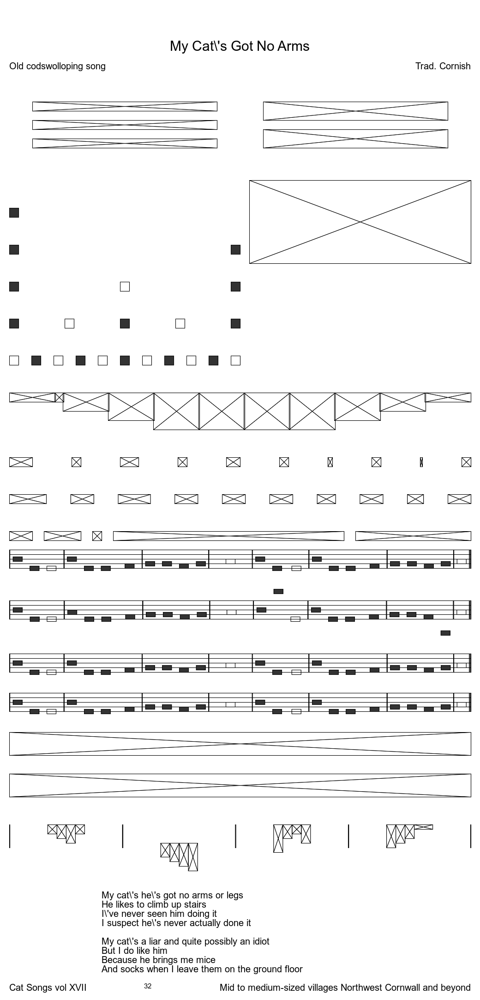

# Layout Experiment

Experimental ideas for a page layout engine, written in Rust. Build page structures and render to SVG. Destined to eventually evolve into something that can used to typeset music for FolkTuneFinder.com.

# Demo

# Demo with bounding box for debugging

# TODO

 - LTR container with fixed width and justification
 - Margins on all types
 