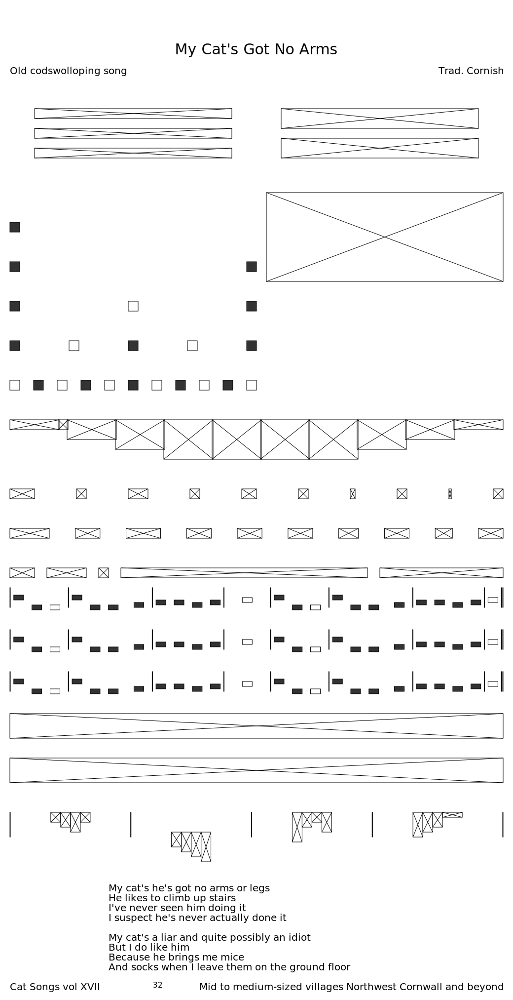

# Layout Experiment

Experimental ideas for a page layout engine, written in Rust. Build page structures in a layout tree, render to SVG. Destined to eventually evolve into something that can used to typeset music for FolkTuneFinder.com.

# Demo

## With debug bounding boxes

## PNG render

# Progress

## 2018-05-09
Callbacks on blank `Node`s for barline and double barline. Drawing these is now handled by callbacks in the `music_typeset` namespace, dynamically hooked into the generic `layout` namespace.

## 2018-05-08

Start of a `music_typeset` domain model which renders to generic `layout` model.

## 2018-05-05

Left-to-right-justified Node is able to accept negative offsets of its children and expand to accommodate. 

## 2018-05-04
Variety of Node types in the `layout` domain model, plus margins.

## 2018-05-02

Start of a box model with justification.

# TODO

 - LTR container with fixed width and justification
 - Margins on all types
 